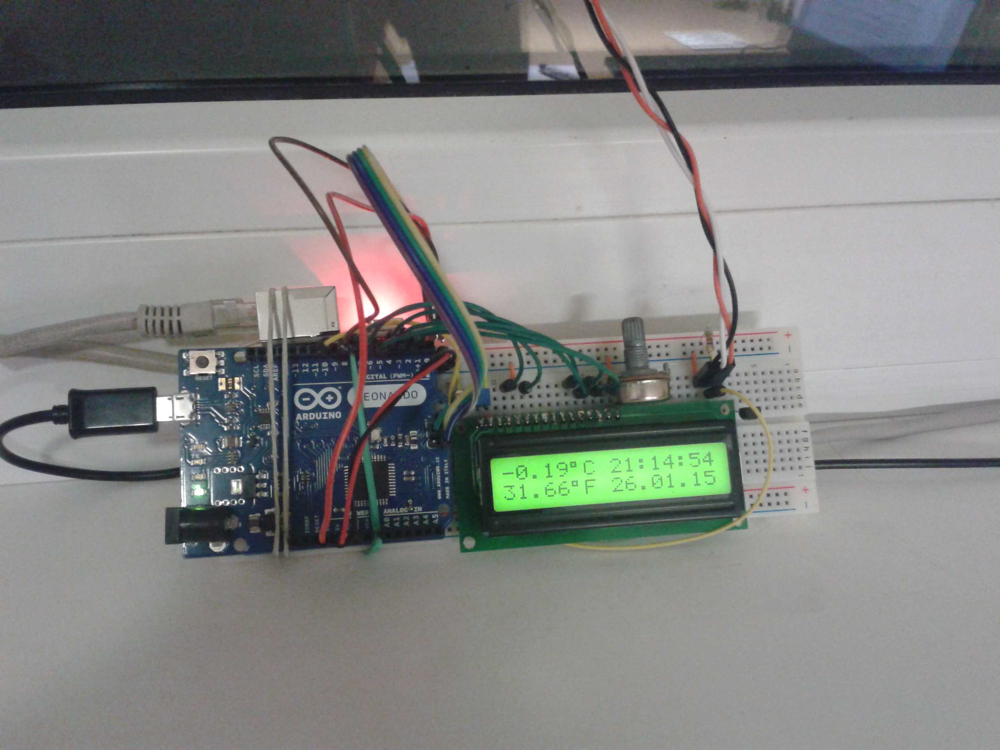
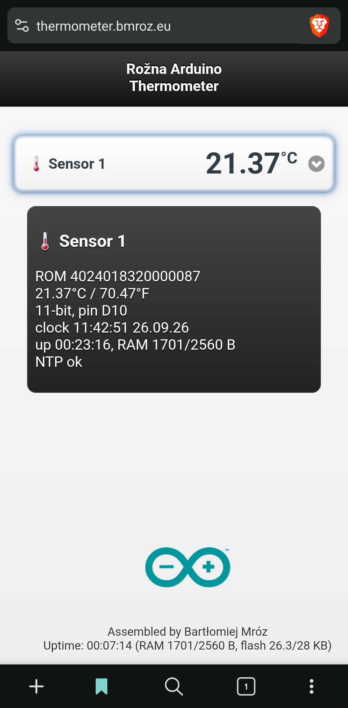

[-00979D.svg?logo=arduino&logoColor=white)]() []() []() []() []() []() [](./LICENSE)

# arduino-thermometer - Rožna Arduino Thermometer

A networked temperature monitor first built in 2015 in a student dorm on Rožna
dolina (Ljubljana), revived in 2026 to watch an office for overheating. An Arduino
**Leonardo** reads a **DS18B20**, shows the temperature and an NTP clock on a 16x2
LCD, and serves the original jQuery-Mobile web page plus a `/list.json` API over
Ethernet (**ENC28J60**). Assembled by Bartłomiej Mróz.

The 2015 code is kept as the reference; the revival modernises it for current
toolchains, fixes the one thing that never worked back then (the ENC28J60 needed a
hardware reset), and adds resilience so it can run headless and unattended.

| 2015, the original build | 2026, the revived web UI |
|:---:|:---:|
|  |  |

*Left: the original 2015 build, LCD reading -0.19 C at 21:14 on 26 Jan 2015. Right: the revived 2026 web UI (Brave on Android) with a sensor's detail panel expanded.*

## History

The original ran in a Ljubljana student dorm where the network was unusually open:
each room got two public, routable IP addresses (one per desk), so the thermometer's
page was reachable from the open internet, not just the LAN. Our room's router ran
OpenWrt with 802.1X on the WiFi, so we were the only ones online in there, which is
part of why a tiny ENC28J60 web server made sense at all. The 2026 revival runs on a
normal office LAN, so the page is LAN-only now unless you forward a port.

## Status

Working and validated on real hardware. The diagnostics pass, the modernised
sketch serves the original web UI and `/list.json`, NTP sets the clock, the
SleepyDog watchdog runs, and the Ethernet stack recovers from faults on its own.
Telegram alerting (Stage D) is designed but deferred (it lives off-device, on a
Raspberry Pi).

| Subsystem | State |
|---|---|
| Board, upload, Serial | working |
| 16x2 LCD (temperature + clock) | working |
| DS18B20 temperature | working |
| ENC28J60 Ethernet, web, `/list.json` | working (needs `RST` wired to D9, see below) |
| NTP clock | working |
| Watchdog and resilience | working |
| Telegram alerting | deferred (Pi-side poller, see *Alerting*) |

## Hardware and wiring

- **Arduino Leonardo** (ATmega32u4). Real ceilings: about 28 KB usable flash (a 4 KB
  bootloader eats into the 32 KB) and 2560 B of RAM. RAM is the tight one (the
  Ethernet buffer alone is over 1 KB).
- **ENC28J60** Ethernet module (EtherCard library)
- **DS18B20** temperature sensor (OneWire + DallasTemperature)
- **16x2 HD44780 LCD**, 4-bit, with a contrast potentiometer
- Powered over USB

### Pin map

| Signal | Leonardo pin | Notes |
|---|---|---|
| LCD | see LCD pin map below | 16x2 HD44780, 4-bit mode, `LiquidCrystal lcd(7,6,5,4,3,2)` |
| DS18B20 DATA | D10 | 4.7 kOhm pull-up DATA to 5V, required |
| ENC28J60 SPI (MISO/MOSI/SCK) | ICSP header | not pins 11/12/13 on a Leonardo |
| ENC28J60 CS | D8 | see "CS gotcha" below |
| ENC28J60 RST | D9 | required, see "RST gotcha" below |
| ENC28J60 VCC / GND | 3.3V (or 5V if the module has a regulator) / GND | |

### LCD pin map

| LCD signal | LCD header pin | Connects to | Notes |
|---|---|---|---|
| VSS | 1 | GND | |
| VDD | 2 | +5V | |
| V0 | 3 | contrast pot wiper | pot ends to 5V and GND |
| RS | 4 | Leonardo D7 | |
| RW | 5 | GND | not driven by the firmware, tied low |
| E | 6 | Leonardo D6 | |
| D0-D3 | 7-10 | not connected | 4-bit mode |
| D4 | 11 | Leonardo D5 | |
| D5 | 12 | Leonardo D4 | |
| D6 | 13 | Leonardo D3 | |
| D7 | 14 | Leonardo D2 | |
| A | 15 | +5V (through ~220R if the module has no onboard resistor) | backlight |
| K | 16 | GND | backlight |

**CS gotcha.** EtherCard's `begin()` default chip-select drifted from pin 8 (old)
to `SS`, which is pin 17 on the Leonardo (current library). The 2015 sketch relied
on the old default, so the real wiring is CS=8. The sketch sets `CS_PIN 8`
explicitly.

**RST gotcha (the actual 2015 bug).** The ENC28J60 needs a hardware reset pulse or
its PHY will not link. That was the original "never appears on the router" symptom.
Wire `RST` to D9; the firmware pulses it before every `ether.begin()`. Note that SPI
register reads are clocked by the Arduino, so the chip answers SPI even when its own
25 MHz crystal is not running. The firmware therefore also checks the
oscillator-ready bit (`CLKRDY`) before trusting it.

**Solid connections matter.** On a breadboard with dupont wires, bumping the board
can knock the ENC's SPI or power loose (this happened repeatedly during bring-up).
For a permanent install, solder or use locking connectors on the ENC's SPI, power
and RST lines.

### Enclosure

A 3D-printed enclosure, designed by Daniel Wiśniewski, a colleague from the
Department of Multimedia Systems, houses the board and brings the LCD, contrast
pot and brightness pot to the front panel. The two potentiometers are labelled
with brightness and contrast icons adapted from Flaticon (see [License](#license)
for credit). Design files are in [`enclosure/`](enclosure/): the full assembly
([`Termo_ass.step`](enclosure/Termo_ass.step)) and the two printable parts
([`Termo_box.stl`](enclosure/Termo_box.stl), [`Termo_lid.stl`](enclosure/Termo_lid.stl)).
A live, editable version is also on
[Fusion 360](https://mypg468.autodesk360.com/g/shares/SH28cd1QT2badd0ea72b3ebdcf2fd0c9138a).
Photos to follow in `docs/`.

## How it works

### Web UI and API

The Arduino serves only a small HTML shell plus `main.css`, `main.js`, `det.js` and
`/list.json`. The heavy assets (jQuery 1.8.2, jQuery-Mobile 1.2.0 js+css,
`date.format.js`) are loaded by the browser from `code.jquery.com` over HTTPS; at
about 284 KB they would never fit in 28 KB of flash. This is the original 2015
architecture, preserved.

- `GET /` serves the HTML shell (header "Rožna Arduino Thermometer", inset
  listview, footer).
- `GET /main.css`, `GET /main.js`, `GET /det.js` are served from PROGMEM.
- `GET /list.json` returns `{"list":[{"id","name","val","ifnegative"}],"uptime","free","res","pin","ntp","now"}`,
  where `val` is degrees C times 100 (the JS divides by 100). The footer shows the
  "Assembled by Bartłomiej Mróz" credit, uptime, and memory use (RAM and flash both
  as used / total, matching the Arduino IDE).
- Tapping a sensor row slides open an inline detail panel (and rotates the row's
  arrow 90 degrees): ROM id, C and F, resolution, data pin, the NTP clock (same as
  the LCD), uptime, RAM use and NTP status. Tap again to collapse.

**Images.** The browser-tab icon is a self-contained thermometer emoji served as a
tiny SVG from its own `/favicon.svg` route. The footer logo (`ardu.png`) is a raster
image, browser-loaded from an external host (`FOOTER_LOGO_URL`, currently ImgBB);
the Arduino never serves image bytes. Static assets are cache-busted with a `?v=`
version (`ASSET_VER`), so changes reach the browser without a manual cache clear.

### NTP clock

Replaces the original serial time-sync, which froze the board at boot waiting for a
PC. `serviceTime()` resolves `pool.ntp.org` over DNS (via the router), sends an NTP
request, and the answer sets the Time library clock. It re-syncs hourly. If DNS
keeps failing it backs off and gives up so it can never stall the loop, and the LCD
falls back to uptime. There is no automatic DST; set `UTC_OFFSET_SEC` for the season.

### Performance

- **Non-blocking sensor.** DS18B20 conversions run asynchronously
  (`waitForConversion=false`), started on a timer and read about `CONV_DELAY_MS`
  later. Neither the LCD nor `/list.json` waits on a conversion, so `/list.json`
  answers in about 40 ms. The old code blocked roughly 750 ms, twice.
- **Browser caching.** `main.css`, `main.js`, `det.js` and `favicon.svg` are sent
  with `Cache-Control: max-age=86400`; only `/list.json` is `no-cache`.
- **LCD in place.** It repaints without `lcd.clear()` (no flicker), about twice a
  second so the seconds never skip, and temperatures are formatted with integer
  math so the float-to-string code is never linked.

### Resilience

- Hardware reset of the ENC28J60 (`RST` to D9) before every bring-up.
- A bounded SPI plus CLKRDY probe before `ether.begin()`. `begin()` spins forever on
  an unresponsive chip, so it is never called unless the chip answers and its
  oscillator is running. A missing or dead NIC drops to OFFLINE: the LCD and sensor
  keep working and the firmware retries the NIC every 15 s.
- SleepyDog watchdog (8 s), safe on the 32u4 bootloader.
- Temperature and LCD are fully decoupled from the network, so the monitor always
  works.

## Build and upload

Built with **arduino-cli 1.5.1**, core **arduino:avr 1.8.8**, FQBN
`arduino:avr:leonardo`. Libraries:

| Library | Version |
|---|---|
| OneWire | 2.3.8 |
| DallasTemperature | 4.0.6 |
| EtherCard | 1.1.0 |
| Adafruit SleepyDog Library | 1.8.4 |
| Time | 1.6.1 |
| LiquidCrystal | 1.0.7 |

Footprint: about 24.2 KB of 28 KB flash (84 %), about 1.6 KB of 2.5 KB RAM (64 %).

```sh
# one-time setup
arduino-cli core install arduino:avr
arduino-cli lib install OneWire DallasTemperature EtherCard "Adafruit SleepyDog Library" Time LiquidCrystal

# find the port
arduino-cli board list                        # e.g. /dev/cu.usbmodem1101

# compile THEN upload (arduino-cli upload does NOT recompile, so always compile first)
arduino-cli compile -b arduino:avr:leonardo firmware/TempServerJQuery
arduino-cli upload  -b arduino:avr:leonardo -p <PORT> firmware/TempServerJQuery

# watch Serial at 9600
arduino-cli monitor -p <PORT> -c baudrate=9600
```

Bring up the subsystems first with the `diagnostics/` sketches (upload each, read
Serial), then flash the main sketch.

**If upload fails (`butterfly_recv ... failed`).** The Leonardo's 1200-baud
auto-reset can stop dropping the board into the Caterina bootloader (common after
many upload cycles, or with a watchdog sketch), and arduino-cli then flashes against
the running sketch and fails. Recovery: double-tap RESET (the "L" LED pulses, which
means the bootloader is up for about 8 s) and flash with avrdude directly, bypassing
the 1200-baud touch:

```sh
AV=~/Library/Arduino15/packages/arduino/tools/avrdude/8.0.0-arduino1
# the hex path is shown by:  arduino-cli upload -v ...   (under ~/Library/Caches/arduino/sketches/<hash>/)
"$AV/bin/avrdude" "-C$AV/etc/avrdude.conf" -patmega32u4 -cavr109 -P<PORT> -b57600 -D \
  -Uflash:w:<sketch>.ino.hex:i
```

## Configuration (top of the sketch)

| Macro | Default | Meaning |
|---|---|---|
| `ETH_ENABLED` | `1` | `0` runs it as a pure thermometer, no NIC access at all |
| `USE_NTP` | `1` | `0` skips NTP and DNS; the LCD shows uptime and the web never stalls |
| `DEBUG` | `0` | `1` prints a 3 s Serial heartbeat; `0` is quiet and leaner |
| `SENSOR_RES` | `11` | DS18B20 resolution bits 9 to 12 (11 is 0.125 C, about 375 ms) |
| `CS_PIN` | `8` | ENC28J60 chip-select |
| `ETH_RST_PIN` | `9` | ENC28J60 hardware reset (comment out if unwired) |
| `ONE_WIRE_BUS` | `10` | DS18B20 data pin |
| `mymac` | `02:52:6F:7A:6E:61` | locally-administered MAC |
| `myip` / `gwip` / `dnsip` / `mask` | `192.168.1.200` / `.1` / `.1` / `/24` | office network |
| `UTC_OFFSET_SEC` | `2*3600` | CEST (summer); use `1*3600` for CET (winter) |
| `ASSET_VER` | `"6"` | cache-bust version; bump when main.css/main.js/det.js change |
| `FOOTER_LOGO_URL` | ImgBB link | footer logo image |

For bench testing on a different subnet, change `myip` / `gwip` / `dnsip` (for
example to `192.168.0.x`).

## Diagnostics

Upload each, read Serial at 9600. Pass criteria:

| Sketch | Pass |
|---|---|
| `diag_01_blink` | on-board "L" LED blinks about 1 Hz; Serial prints `tick N` |
| `diag_02_lcd` | LCD shows `Rozna Thermo OK` and a live counter (adjust contrast if blank) |
| `diag_03_ds18b20` | `Found N device(s)`, a `28...` ROM with `CRC OK`, a plausible temperature |
| `diag_04_ethernet` | `ENC28J60 found, rev N`, IP set, `Link: UP`, answers `ping` |

## What changed since the 2015 code

The 2015 architecture was sound and is largely preserved: the web design,
`/list.json`, the HTTP parser, sensor enumeration and LCD layout are essentially
unchanged. The changes fall into three buckets.

**Trivial modernisation**

- MAC changed from the textbook `DE:AD:BE:EF:FE:ED` to a locally-administered `02:..`
- Explicit `CS=8` (EtherCard's default CS drifted to `SS`, pin 17, on the Leonardo)
- `<Time.h>` to `<TimeLib.h>`; verified against current DallasTemperature, OneWire and EtherCard
- CDN tags switched from protocol-relative `//` to `https://`
- Removed the dead `s3.postimg.org` footer image; kept the credit, uptime and free-RAM footer

**One feature swap**

- NTP replaces serial time-sync, so the board no longer freezes at boot waiting for
  a connected PC and keeps real time headless.

**Reliability, the bulk of the new code and the real 2015 fix**

- Hardware reset of the ENC28J60 over `RST` to D9, the missing piece that made the
  PHY actually link (the original "never appears on the router" bug).
- An SPI plus CLKRDY probe before `ether.begin()`, so a missing, dead or
  half-connected NIC can never hang the board; it degrades to OFFLINE and retries.
- SleepyDog watchdog (safe on the 32u4).
- DNS backoff and give-up so a failing NTP lookup can never stall the LCD or web.
- Temperature and LCD decoupled from Ethernet; a Serial heartbeat for observability.
- Async sensor reads, browser-cached static assets with cache-busting, integer
  formatting, 11-bit DS18B20, and the expandable per-sensor detail panel.

## Known issues

- The ENC28J60 module is the weak link. Its 25 MHz oscillator can be intermittent (a
  cold solder joint on the crystal or its caps, or marginal power); a power-cycle plus
  the RST pulse revives it. If it stays flaky, reflow the crystal joints or replace
  the module (about 3 USD); the firmware and EtherCard code are unchanged either way.
- Latency is jittery (it is a slow 10 Mbps chip on breadboard wiring) but lossless
  once connected.
- No automatic DST; set `UTC_OFFSET_SEC` per season.
- A static-IP ENC28J60 takes no DHCP lease, so it will not appear in the router's
  device list. Verify with `ping`, not the router UI.

## Alerting (Stage D, deferred)

The ENC28J60 cannot do TLS, so the Arduino cannot call Telegram (HTTPS only)
directly. The planned design is a small poller on the Raspberry Pi (which already
runs a Telegram bot) that fetches `/list.json` every few minutes and sends an alert
when the temperature crosses a threshold, keeping the Arduino dumb and reusing
working infrastructure. Open question before building it: whether the Pi
(192.168.50.x) can route to the office Arduino (192.168.1.x), or whether a relay or
office-side host is needed.

## Repository layout

```
firmware/TempServerJQuery/TempServerJQuery.ino   the modernised sketch (office IP)
diagnostics/diag_01_blink/ ... diag_04_ethernet/ Stage A bring-up sketches
original-2015/                                    the untouched 2015 sketches (reference)
ardu_tempserver_logos/                            logo/icon source files
docs/                                             README images
README.md  LICENSE  .gitignore
```

## License

MIT. See [LICENSE](LICENSE). The Arduino libraries this builds against are not
included and remain under their own licenses. The enclosure's brightness and
contrast icons are adapted from Flaticon: [Brightness icon](https://www.flaticon.com/free-icon/brightness_466300)
by Freepik, [Contrast icon](https://www.flaticon.com/free-icon/contrast_475980)
by Smartline, used under Flaticon's free license and not covered by the MIT
license above.

## Contact

Bartłomiej Mróz · bartlomiej.mroz@pg.edu.pl · Department of Multimedia Systems, Gdańsk University of Technology · [bmroz.eu](https://bmroz.eu)
