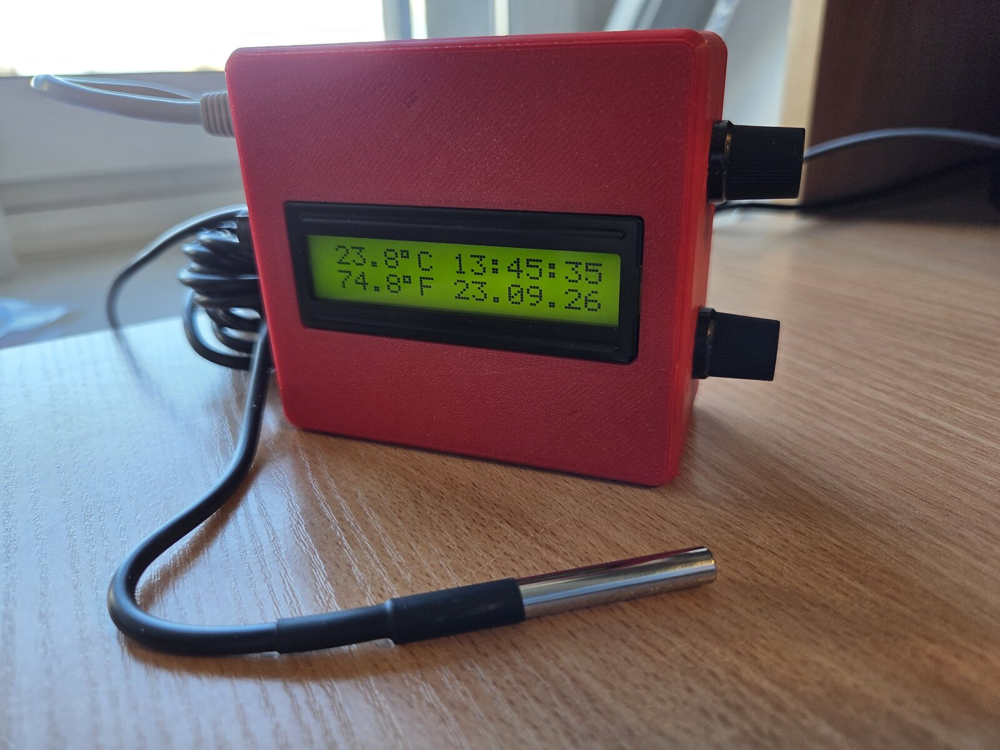
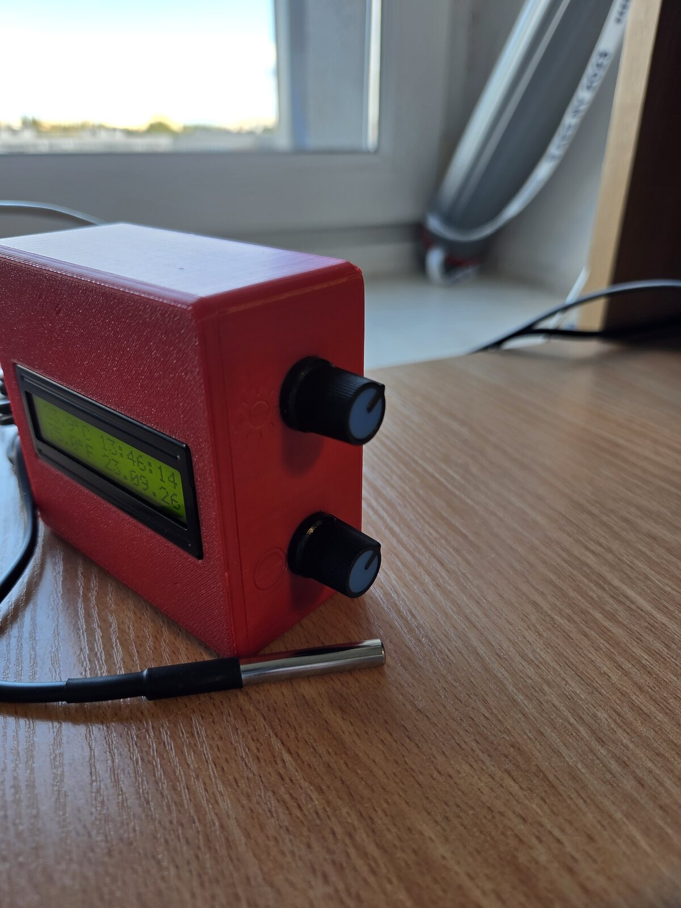
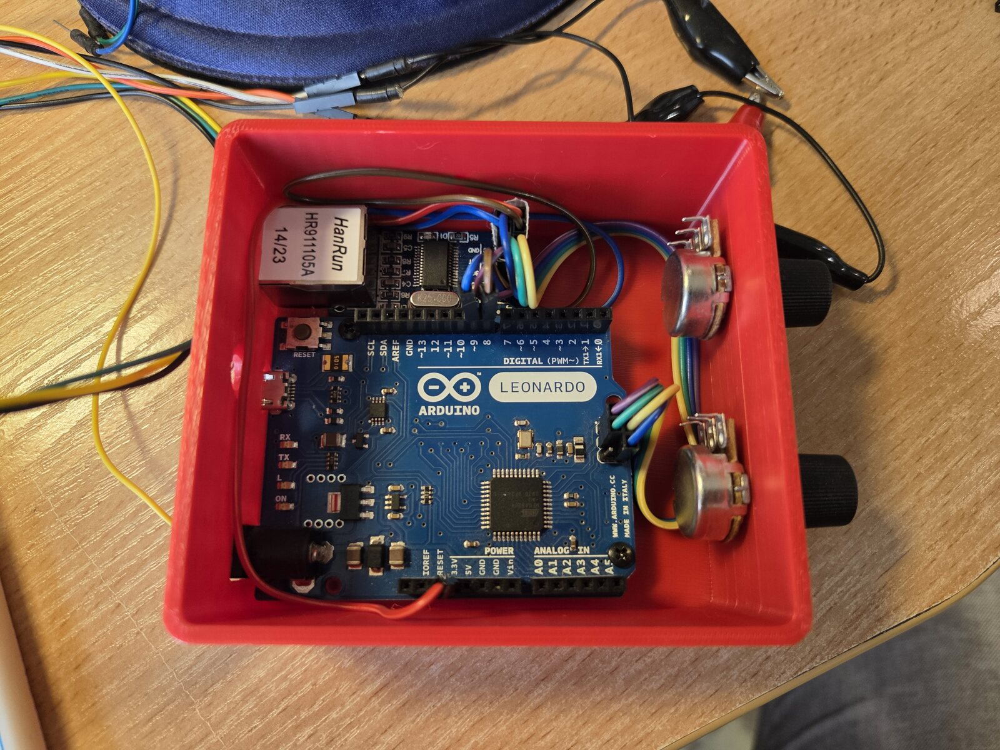
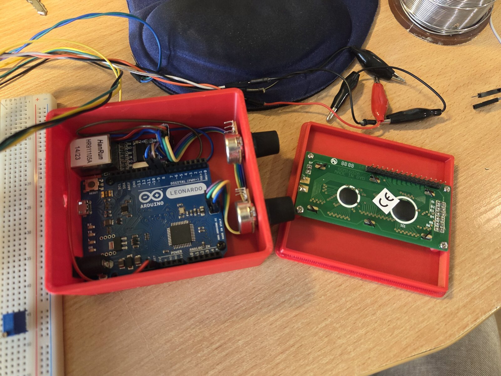
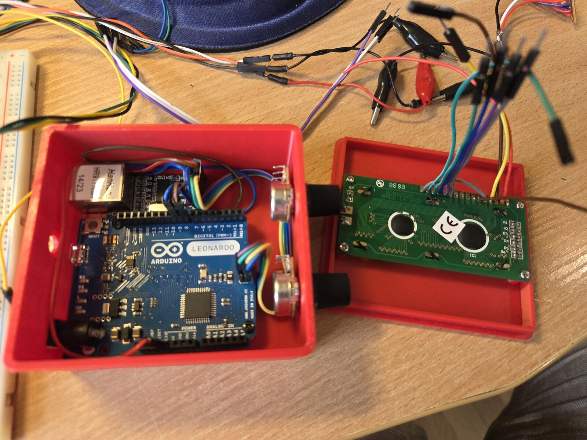
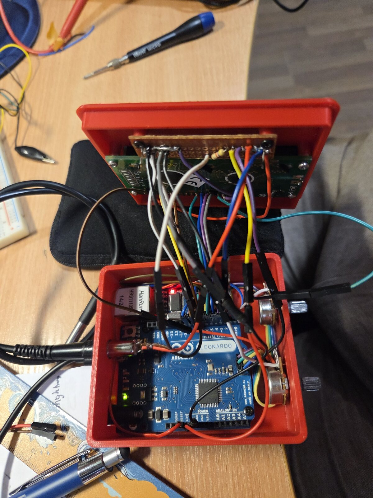

[-00979D.svg?logo=arduino&logoColor=white)]() []() []() []() []() []() [](./LICENSE)

# rozna-thermometer - Rožna Arduino Thermometer

A networked temperature monitor first built in 2015 in a student dorm on Rožna
dolina (Ljubljana), revived in 2026 for reliable, unattended temperature monitoring.
An Arduino **Leonardo** reads a **DS18B20** sensor, shows the temperature and an NTP
clock on a 16x2 LCD, and serves the original jQuery-Mobile web page plus a
`/list.json` API over Ethernet (**ENC28J60**).

The 2015 code is kept as the reference; the revival modernises it for current
toolchains, fixes the one thing that never worked back then (the ENC28J60 needed a
hardware reset), and adds resilience so it can run headless and unattended.

| 2015, the original build | 2026, the revived build | 2026, the public web UI |
|:---:|:---:|:---:|
| <a href="docs/original-2015-build.jpg"></a> | <a href="docs/enclosure-front.jpg"></a> | <a href="docs/web-ui-2026.png"></a> |

*Left: the original 2015 build, LCD reading -0.19 C at 21:14 on 26 Jan 2015. Middle: the 2026 build in its 3D-printed enclosure, the DS18B20 probe on its cable in front. Right: the public web UI at [thermometer.bmroz.eu](https://thermometer.bmroz.eu) (Brave on Android) with a sensor's detail panel expanded. Click an image for the full size.*

## History

The original ran in a Ljubljana student dorm where the network was unusually open:
each room got two public, routable IP addresses (one per desk), so the thermometer's
page was reachable from the open internet, not just the LAN. Our room's router ran
OpenWrt with 802.1X on the WiFi, so we were the only ones online in there, which is
part of why a tiny ENC28J60 web server made sense at all. The 2026 revival runs on an
ordinary LAN, wherever it is plugged in, so the board itself is LAN-only. The page is
made public through a caching proxy and a Cloudflare tunnel on a Raspberry Pi instead
of a router port forward (see [Public access](#public-access)).

## Status

Working and validated on real hardware. The diagnostics pass, the modernised
sketch serves the original web UI and `/list.json`, NTP sets the clock, the
SleepyDog watchdog runs, and the Ethernet stack recovers from faults on its own.
Telegram alerting (Stage D) is designed but deferred (it lives off-device, on a
Raspberry Pi).

| Subsystem | State |
|---|---|
| Board, upload, Serial | working |
| 16x2 LCD (temperature + clock) | working |
| DS18B20 temperature | working |
| ENC28J60 Ethernet, web, `/list.json` | working (needs `RST` wired to D9, see below) |
| NTP clock | working |
| Watchdog and resilience | working |
| Public page, https://thermometer.bmroz.eu | working (nginx cache and Cloudflare tunnel on a Pi, see `pi/`) |
| Telegram alerting | deferred (Pi-side poller, see [Alerting](#alerting-possible-not-planned)) |

## Hardware and wiring

- **Arduino Leonardo** (ATmega32u4). Real ceilings: about 28 KB usable flash (a 4 KB
  bootloader eats into the 32 KB) and 2560 B of RAM. RAM is the tight one (the
  Ethernet buffer alone is over 1 KB).
- **ENC28J60** Ethernet module (EtherCard library)
- **DS18B20** temperature sensor (OneWire + DallasTemperature)
- **16x2 HD44780 LCD**, 4-bit, with a contrast potentiometer
- Powered over USB

### Pin map

| Signal | Leonardo pin | Notes |
|---|---|---|
| LCD | see LCD pin map below | 16x2 HD44780, 4-bit mode, `LiquidCrystal lcd(7,6,5,4,3,2)` |
| DS18B20 DATA | D10 | 4.7 kOhm pull-up DATA to 5V, required |
| ENC28J60 SPI (MISO/MOSI/SCK) | ICSP header | not pins 11/12/13 on a Leonardo |
| ENC28J60 CS | D8 | see Gotchas below |
| ENC28J60 RST | D9 | required, see Gotchas below |
| ENC28J60 VCC / GND | 3.3V (or 5V if the module has a regulator) / GND | |

**The probe plugs in through a 3.5 mm jack.** A small nod to my audio work these
days, and honestly just the first 3-pin connector that came to mind and was easy to
get. It works well, with two things to know. A plug bridges neighbouring contacts
while it is being inserted, so the layout matters for hot-plugging: tip = +5V, ring
(the middle contact) = GND, sleeve = DATA, which turns the unavoidable transient
shorts into +5V to GND and DATA to GND instead of +5V to DATA. And a series resistor
of 220 to 470 ohms in the +5V line is cheap insurance against a plug pulled out at an
angle. The 4.7 kOhm pull-up still has to bridge DATA to +5V as its own branch, not sit
in line with the signal.

### LCD pin map

| LCD signal | LCD header pin | Connects to | Notes |
|---|---|---|---|
| VSS | 1 | GND | |
| VDD | 2 | +5V | |
| V0 | 3 | contrast pot wiper | pot ends to 5V and GND |
| RS | 4 | Leonardo D7 | |
| RW | 5 | GND | not driven by the firmware, tied low |
| E | 6 | Leonardo D6 | |
| D0-D3 | 7-10 | not connected | 4-bit mode |
| D4 | 11 | Leonardo D5 | |
| D5 | 12 | Leonardo D4 | |
| D6 | 13 | Leonardo D3 | |
| D7 | 14 | Leonardo D2 | |
| A | 15 | +5V (through ~220R if the module has no onboard resistor) | backlight |
| K | 16 | GND | backlight |

**Gotchas.** The ENC28J60 needs a hardware reset: wire its `RST` to D9, or its PHY
never links (that was the 2015 "never appears on the router" bug). Keep its chip
select on D8, because EtherCard's default drifted to pin 17 on the Leonardo. Both are
set in the sketch. Connections on a breadboard are easily bumped loose, so solder or
use locking connectors for a permanent install. More in
[docs/hardware-notes.md](docs/hardware-notes.md).

### Enclosure

A 3D-printed enclosure, designed by Daniel Wiśniewski, a colleague from the
Department of Multimedia Systems, houses the board and brings the LCD, contrast
pot and brightness pot to the front panel. The two potentiometers are labelled
with brightness and contrast icons adapted from Flaticon (see [License](#license)
for credit). Design files are in [`enclosure/`](enclosure/): the full assembly
([`Termo_ass.step`](enclosure/Termo_ass.step)) and the two printable parts
([`Termo_box.stl`](enclosure/Termo_box.stl), [`Termo_lid.stl`](enclosure/Termo_lid.stl)).
A live, editable version is also on
[Fusion 360](https://mypg468.autodesk360.com/g/shares/SH28cd1QT2badd0ea72b3ebdcf2fd0c9138a).
The Leonardo's RESET button is inside the box, so a manual reset means opening the
lid (the firmware restarts itself when it has to).

| The knobs: brightness (top), contrast (bottom) | Inside, lid off (assembly, August 2026) | The lid carries the LCD (assembly, August 2026) |
|:---:|:---:|:---:|
| <a href="docs/enclosure-side-knobs.jpg"></a> | <a href="docs/enclosure-inside.jpg"></a> | <a href="docs/enclosure-open-lid.jpg"></a> |

It is cramped and not pretty inside. These two were taken during assembly, before the
lid went on. The LCD's pin header was removed and wires were soldered straight to its
pads, because the header pins stuck out too far and collided with the Arduino's pin
sockets.

| Mid-wiring, wires soldered straight to the LCD (August 2026) | Wired up right before closing the lid (August 2026) |
|:---:|:---:|
| <a href="docs/enclosure-wiring-midway.jpg"></a> | <a href="docs/enclosure-wiring-closing.jpg"></a> |

## How it works

The Arduino serves the original 2015 jQuery-Mobile page (`/`, `main.css`, `main.js`,
`det.js`, `/favicon.svg`) and a `/list.json` API with the temperature and the health
fields. The heavy jQuery and jQuery-Mobile files load from `code.jquery.com`, because
284 KB would never fit in 28 KB of flash. The clock comes from NTP with a fixed server
IP (a DNS lookup used to freeze the whole loop), and EU summer time is computed on the
board. Sensor reads are asynchronous, so nothing waits on a 750 ms conversion. Details
and the JSON fields: [docs/how-it-works.md](docs/how-it-works.md).

### Resilience

The ENC28J60 is the weak link, so the firmware is built to survive it and to recover
without a person:

- A hardware reset over `RST` (D9) and a bounded SPI and oscillator check before
  `ether.begin()`, so a dead NIC never hangs the board. The LCD and the sensor keep
  working, and the NIC is retried every 15 s.
- The NIC is never re-initialised in place after traffic (EtherCard cannot resync its
  receive pointers). Instead a gateway ARP round trip proves the network path, and a
  watchdog restart of the MCU (about 5 s) follows 5 minutes of silence (2 once the chip has flagged a receive overflow) or 3 minutes
  without a link.
- The chip's key registers are checked every 10 s. The evidence (`rst`, `why`, `dbg`)
  survives a restart and is served in `/list.json`.
- Two LCD status cells stay blank when all is well: row 1 character 8 counts recent
  self-restarts, row 2 character 8 shows `O` (NIC offline), `L` (no link) or `S` (link
  up, no gateway reply).
- The DS18B20 can be plugged in at any time.

Full description: [docs/resilience.md](docs/resilience.md).

### Public access

The page is public at https://thermometer.bmroz.eu, but visitors never reach the
Arduino:

```
visitor -> Cloudflare (HTTPS) -> cloudflared on the Pi -> nginx cache on the Pi (127.0.0.1:8081) -> Arduino
```

A Raspberry Pi on the same LAN answers visitors from a cache and forwards about one
request per 10 s to the board, however many people watch. No router port is
forwarded, and none should be: the board speaks plain HTTP with no authentication.
Configs and setup steps: [pi/](pi/README.md).

## Build and upload

Built with **arduino-cli 1.5.1**, core **arduino:avr 1.8.8**, FQBN
`arduino:avr:leonardo`. Libraries:

| Library | Version |
|---|---|
| OneWire | 2.3.8 |
| DallasTemperature | 4.0.6 |
| EtherCard | 1.1.0 |
| Adafruit SleepyDog Library | 1.8.4 |
| Time | 1.6.1 |
| LiquidCrystal | 1.0.7 |

Footprint: about 26.3 KB of 28 KB flash (93 %), about 1.6 KB of 2.5 KB RAM (65 %).

```sh
# one-time setup
arduino-cli core install arduino:avr
arduino-cli lib install OneWire DallasTemperature EtherCard "Adafruit SleepyDog Library" Time LiquidCrystal

# find the port
arduino-cli board list                        # e.g. /dev/cu.usbmodem1101

# compile THEN upload (arduino-cli upload does NOT recompile, so always compile first)
arduino-cli compile -b arduino:avr:leonardo firmware/TempServerJQuery
arduino-cli upload  -b arduino:avr:leonardo -p <PORT> firmware/TempServerJQuery

# watch Serial at 9600
arduino-cli monitor -p <PORT> -c baudrate=9600
```

Bring up the subsystems first with the `diagnostics/` sketches (upload each, read
Serial), then flash the main sketch.

**If upload fails** with `butterfly_recv ... failed`, the Leonardo's 1200-baud
auto-reset did not reach the bootloader. See [docs/flashing.md](docs/flashing.md).

## Configuration (top of the sketch)

| Macro | Default | Meaning |
|---|---|---|
| `ETH_ENABLED` | `1` | `0` runs it as a pure thermometer, no NIC access at all |
| `USE_NTP` | `1` | `0` skips NTP and DNS; the LCD shows uptime and the web never stalls |
| `DEBUG` | `0` | `1` prints a 3 s Serial heartbeat; `0` is quiet and leaner |
| `SENSOR_RES` | `11` | DS18B20 resolution bits 9 to 12 (11 is 0.125 C, about 375 ms) |
| `CS_PIN` | `8` | ENC28J60 chip-select |
| `ETH_RST_PIN` | `9` | ENC28J60 hardware reset (comment out if unwired) |
| `ONE_WIRE_BUS` | `10` | DS18B20 data pin |
| `mymac` | `02:52:6F:7A:6E:61` | locally-administered MAC |
| `myip` / `gwip` / `dnsip` / `mask` | `192.168.1.200` / `.1` / `.1` / `/24` | the network it is deployed on |
| `UTC_STD_OFFSET_SEC` | `1*3600` | CET (winter) offset; EU summer time is added automatically |
| `PROBE_MS` / `AUDIT_MS` / `SILENT_RESTART_MS` / `SILENT_FAST_MS` / `LINK_DOWN_RESTART_MS` | 30 s / 10 s / 5 min / 2 min / 3 min | gateway ARP probe and chip register check intervals, then MCU restart when the gateway never replies or the link is lost |
| `ASSET_VER` | `"9"` | cache-bust version; bump when main.css/main.js/det.js change |
| `FOOTER_LOGO_URL` | ImgBB link | footer logo image |

For bench testing on a different subnet, change `myip` / `gwip` / `dnsip` (for
example to `192.168.0.x`).

## Diagnostics

Upload each, read Serial at 9600. Pass criteria:

| Sketch | Pass |
|---|---|
| `diag_01_blink` | on-board "L" LED blinks about 1 Hz; Serial prints `tick N` |
| `diag_02_lcd` | LCD shows `Rozna Thermo OK` and a live counter (adjust contrast if blank) |
| `diag_03_ds18b20` | `Found N device(s)`, a `28...` ROM with `CRC OK`, a plausible temperature |
| `diag_04_ethernet` | `ENC28J60 found, rev N`, IP set, `Link: UP`, answers `ping` |

## What changed since the 2015 code

The 2015 architecture was sound and is largely preserved. The changes are a few
modernisations, NTP instead of a serial time-sync, and a lot of reliability work (the
hardware reset was the real 2015 fix). See
[docs/changes-since-2015.md](docs/changes-since-2015.md).

## Known issues

- The ENC28J60 module is the weak link. Its 25 MHz oscillator can be intermittent (a
  cold solder joint on the crystal or its caps, or marginal power); a power-cycle plus
  the RST pulse revives it. If it stays flaky, reflow the crystal joints or replace
  the module (about 3 USD); the firmware and EtherCard code are unchanged either way.
- Latency is jittery (it is a slow 10 Mbps chip on breadboard wiring) but lossless
  once connected.
- Field failures on 2026-09-25 and 2026-09-26, cause not yet proven: the board stops
  answering ARP and TCP until it is restarted. The gateway ARP round trip now detects
  it and restarts the board by itself (it did on 09-26, after about 5 minutes), and the
  saved chip snapshot narrows the cause. Details in
  [docs/resilience.md](docs/resilience.md#field-failure-2026-09-25).
- The ENC28J60 module is powered from the Leonardo's 3.3 V pin, documented for only
  about 50 mA against 120 to 200 mA for the chip once linked. On 2026-09-26 its
  registers were repeatedly scrambled while the MCU kept running; the firmware
  restarted itself each time. A separate 3.3 V regulator for the module is the likely
  fix. Details in [docs/resilience.md](docs/resilience.md#chip-state-corruption-2026-09-26-hardware-suspected).
- A static-IP ENC28J60 takes no DHCP lease, so it might not appear in the router's
  device list; some routers list it anyway from ARP traffic they have seen. `ping`
  is the reliable check either way.

## Alerting (possible, not planned)

The ENC28J60 cannot do TLS, so the Arduino cannot call Telegram (HTTPS only)
directly. If this is ever wanted, a small poller on the Raspberry Pi that already
serves the public page (see [pi/](pi/README.md)) could fetch `/list.json` and send
an alert when the temperature crosses a threshold, keeping the Arduino dumb and
reusing infrastructure that already exists. Not being built right now.

## Repository layout

```
firmware/TempServerJQuery/TempServerJQuery.ino   the modernised sketch (static IP)
diagnostics/diag_01_blink/ ... diag_07_.../     bring-up and hardware diagnostic sketches
original-2015/                                    the untouched 2015 sketches (reference)
pi/                                               nginx cache and Cloudflare tunnel config for public access
enclosure/                                        enclosure design files (STEP, STL)
ardu_tempserver_logos/                            logo/icon source files
docs/                                             README images and the detailed notes
README.md  LICENSE  .gitignore
```

## License

MIT. See [LICENSE](LICENSE). The Arduino libraries this builds against are not
included and remain under their own licenses. The enclosure's brightness and
contrast icons are adapted from Flaticon: [Brightness icon](https://www.flaticon.com/free-icon/brightness_466300)
by Freepik, [Contrast icon](https://www.flaticon.com/free-icon/contrast_475980)
by Smartline, used under Flaticon's free license and not covered by the MIT
license above.

## Contact

Bartłomiej Mróz · bartlomiej.mroz@pg.edu.pl · Department of Multimedia Systems, Gdańsk University of Technology · [bmroz.eu](https://bmroz.eu)
